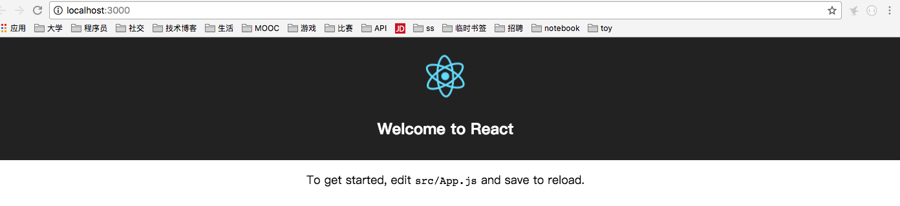

## npm的基本作用和基本指令（至少包括install uninstall，需要学会使用help指令查询帮助）    

```
NPM（node package manager，通常称为node包管理器。顾名思义，它的主要功能就是管理node包，包括：安装、卸载、更新、查看、搜索、发布等。
npm的背后，是基于couchdb的一个数据库，详细记录了每个包的信息，包括作者、版本、依赖、授权信息等。它的一个很重要的作用就是：将开发者从繁琐的包管理工作（版本、依赖等）中解放出来，更加专注于功能的开发。
```

- npm 的包安装分为本地安装（local）、全局安装（global）两种：
```
npm install pkg      # 本地安装,package会被下载到当前所在目录，也只能在当前目录下使用
npm install pkg -g   # 全局安装,package会被下载到到特定的系统目录下，安装的package能够在所有目录下使用
npm uninstall pkg    # 卸载模块
```

- 使用`npm help <command>`可查看某条命令的详细帮助，例如` npm help install `。

- 使用`npm ls`可查看安装了哪些包，同样，如果是要查看package的全局安装信息，加上-g就可以。`npm ls pkg`查看特定package的信息。

- 使用`npm update pkg`可进行更新模块。

- 使用`npm search pkg`可进行搜索。


## 使用npm安装在全局位置安装create-react-app后创建React项目

```
npm install -g create-react-app

create-react-app my-app
cd my-app/
npm start
```
 
